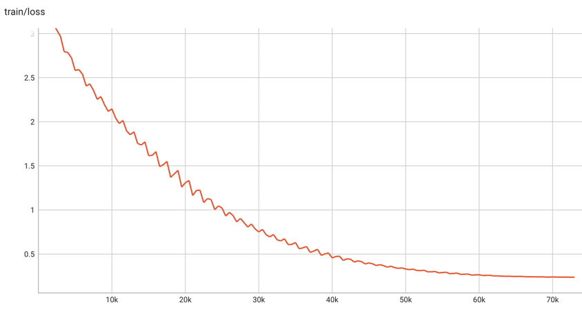
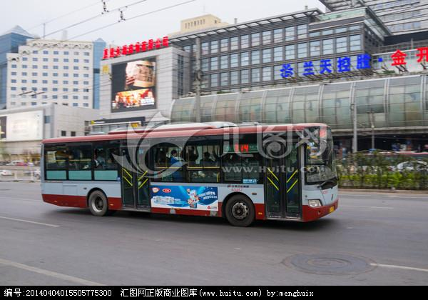

# CLIP-Chinese：中文多模态对比学习CLIP预训练模型

## 项目描述
微信公众号【YeungNLP】文章：[xxx]() ，文章内可获取140w中文图文对预训练数据，以及中文CLIP预训练权重。

CLIP是由OpenAI提出的一种多模态对比学习方法，原模型使用了4亿个图文对进行对比学习训练，在下游的各种任务上均取得了不错的效果，并且在Zero-Shot任务上效果也令人惊艳。 
模型论文可参考[CLIP论文：Learning Transferable Visual Models From Natural Language Supervision](https://arxiv.org/abs/2103.00020)

由于原生的CLIP模型是基于英文语料训练的，无法在中文任务中使用，本项目便是为了解决该问题。 本项目的主要工作如下：
- 编写Vit+Bert结构的CLIP模型，下面将其称为BertCLIP模型，以及预训练的pipeline。
- 基于LiT-tuning（Locked-image Text tuning）的方法，使用140万中文文本数据，对BertCLIP模型进行预训练。
- 在图文相似度、文本相似度、图图相似度等任务上，验证预训练模型的有效性。
- 分享140w中文图文对数据，分享预训练模型权重。

## 预模型权重分享
预训练权重使用方式详见下文

| 预训练模型    | 预训练模型名称 | 模型地址                                                        |
|----------|---------|-------------------------------------------------------------|
| BertCLIP的整体权重 | YeungNLP/clip-vit-bert-chinese-1M     | https://huggingface.co/YeungNLP/clip-vit-bert-chinese-1M    |
| Bert的权重  | YeungNLP/bert-from-clip-chinese-1M     | https://huggingface.co/YeungNLP/bert-from-clip-chinese-1M   |

## 运行环境
python==3.8、transformers==4.18.0、torch==1.12.0


## 项目结构
- data:存放训练数据
  - images：存放训练图片
- images：存放一些测试的图片
- module:一些模块
  - argument.py：定制一些训练配置参数
  - configuration.py：模型配置config
  - datacollator.py
  - dataset.py
  - model.py：模型结构
- train_args：训练参数的配置文件
- download_image.py：下载图片的脚本
- filter_data.py：过滤训练数据的脚本
- train_clip.py：模型训练脚本
- predict_similarity.py：计算图文相似度、文本相似度、图图相似度的脚本

## 模型介绍与训练细节
笔者编写了一个基于Vit+Bert结构的BertCLIP模型，模型结构与原生CLIP大同小异，如下图所示。


预训练时，Vit与Bert分别加载不同的预训练权重，进行初始化。其中Vit的权重使用openai的clip模型进行初始化，
而Bert的权重使用mengzi中文预训练权重进行初始化。 

在训练的时候，使用LiT-tuning（Locked-image Text tuning）的策略，也就是将Vit的权重进行冻结，对模型的其他参数进行训练。使用140w的中文图文对，过滤掉一些坏图，
batch size=768，warmup step为1000步，学习率为5e-5，使用cosine衰减策略，训练50个epoch，大概73100个step，最终训练loss降到0.23左右。


## 使用方法

### Quick Start
使用如下脚本，就可成功加载笔者分享的预训练权重，对图片和文本进行预处理，并且得到模型的输出

```python
from transformers import CLIPProcessor
from component.model import BertCLIPModel
from PIL import Image
import requests

model_name_or_path = 'YeungNLP/clip-vit-bert-chinese-1M'
# 加载预训练模型权重
model = BertCLIPModel.from_pretrained(model_name_or_path)
CLIPProcessor.tokenizer_class = 'BertTokenizerFast'
# 初始化processor
processor = CLIPProcessor.from_pretrained(model_name_or_path)
# 预处理输入
url = "http://images.cocodataset.org/val2017/000000039769.jpg"
image = Image.open(requests.get(url, stream=True).raw)
inputs = processor(text=["一只小狗在摇尾巴", "一只小猪在吃饭"], images=image, return_tensors="pt", padding=True)
inputs.pop('token_type_ids')    # 输入中不包含token_type_ids

outputs = model(**inputs)

# 对于每张图片，计算其与所有文本的相似度
logits_per_image = outputs.logits_per_image  # image-text的相似度得分
probs = logits_per_image.softmax(dim=1)  # 对分数进行归一化

# 对于每个文本，计算其与所有图片的相似度
logits_per_text = outputs.logits_per_text  # text-image的相似度得分
probs = logits_per_text.softmax(dim=1)  # 对分数进行归一化

# 获得文本编码
text_embeds = outputs.text_embeds
# 获得图像编码
image_embeds = outputs.image_embeds
```

单独加载图像编码器，进行下游任务
```python
from PIL import Image
import requests
from transformers import CLIPProcessor, CLIPVisionModel

model_name_or_path = 'YeungNLP/clip-vit-bert-chinese-1M'
model = CLIPVisionModel.from_pretrained(model_name_or_path)
CLIPProcessor.tokenizer_class = 'BertTokenizerFast'
processor = CLIPProcessor.from_pretrained(model_name_or_path)

url = "http://images.cocodataset.org/val2017/000000039769.jpg"
image = Image.open(requests.get(url, stream=True).raw)

inputs = processor(images=image, return_tensors="pt")

outputs = model(**inputs)
last_hidden_state = outputs.last_hidden_state
pooled_output = outputs.pooler_output 
```

单独加载文本编码器，进行下游任务

```python
from component.model import BertCLIPTextModel
from transformers import BertTokenizerFast

model_name_or_path = 'YeungNLP/clip-vit-bert-chinese-1M'
model = BertCLIPTextModel.from_pretrained(model_name_or_path)
tokenizer = BertTokenizerFast.from_pretrained(model_name_or_path)

inputs = tokenizer(["一只小狗在摇尾巴", "一只小猪在吃饭"], padding=True, return_tensors="pt")
inputs.pop('token_type_ids')  # 输入中不包含token_type_ids

outputs = model(**inputs)
last_hidden_state = outputs.last_hidden_state
pooled_output = outputs.pooler_output
```

作者把训练好的Bert模型权重也单独拎出来，可以直接使用BertModel直接加载，进行下游任务
```python
from transformers import BertTokenizer, BertModel

model_name_or_path = 'YeungNLP/bert-from-clip-chinese-1M'
tokenizer = BertTokenizer.from_pretrained(model_name_or_path)
model = BertModel.from_pretrained(model_name_or_path)
```


### 获取训练数据
可以直接使用作者分享的140w的中文训练数据，数据可从公众号文章中获取。也可以使用自己的训练数据。训练数据为csv文件，格式如下，其中filename表示图片下载后的文件名。
```
text,url,filename
欧美夏季ebay连衣裙 气质圆领通勤绑带收腰连衣裙 zc3730,"https://gimg2.baidu.com/image_search/src=http%3A%2F%2Fcbu01.alicdn.com%2Fimg%2Fibank%2F2020%2F527%2F038%2F17187830725_1528924397.220x220.jpg&refer=http%3A%2F%2Fcbu01.alicdn.com&app=2002&size=f9999,10000&q=a80&n=0&g=0n&fmt=jpeg?sec=1632524815&t=d66159b43fb0335c11898f9764847ea7",test-0.jpg
"曾是名不见经传的王平,为何能够取代魏延,成为蜀汉",https://pic.rmb.bdstatic.com/19539b3b1a7e1daee93b0f3d99b8e795.png,test-1.jpg
女童黄色连衣裙,"https://gimg2.baidu.com/image_search/src=http%3A%2F%2Fa.vpimg2.com%2Fupload%2Fmerchandise%2F227958%2FLYQ-S314186413-3.jpg&refer=http%3A%2F%2Fa.vpimg2.com&app=2002&size=f9999,10000&q=a80&n=0&g=0n&fmt=jpeg?sec=1632501843&t=b0a3b843f9ecebd71fe6f27643c17486",test-2.jpg
```

### 下载图片
执行download_image.py脚本，可以直接多线程下载图片，只需要指定线程数、训练文件，以及图片保存路径即可。

### 配置训练参数
在train_args/train_clip.json中按需配置训练参数，参数说明如下：
- output_dir:训练输出路径
- clip_pretrain_path：clip模型的预训练权重
- bert_pretrain_path：bert模型的预训练权重
- load_from_bert_clip：是否使用BertCLIP的模型权重对模型进行初始化。若为False，则需要同时指定clip_pretrain_path与bert_pretrain_path，模型的Vit与Bert的权重分别加载自不同的预训练权重。若为True，则整个BertCLIP模型直接使用clip_pretrain_path的预训练权重进行初始化。
- image_path：存放图片的目录
- train_file：训练集
- test_file：测试集，如果为None，则不进行预测
- num_train_epochs：训练轮次
- max_steps：训练的最大步数，会覆盖num_train_epochs的效果
- per_device_train_batch_size：训练的batch size
- per_device_eval_batch_size：推理的batch size
- learning_rate：学习率
- max_seq_length：文本的最大长度
- logging_steps：多少步打印一次训练日志
- save_steps：多少步保存一次checkpoint
- save_total_limit：最多保存多少个checkpoint
- lr_scheduler_type：学习率的变化策略
- warmup_steps：warmup的步数，会覆盖warmup_ratio的效果
- warmup_ratio：warmup的比例
- gradient_accumulation_steps：梯度累计的步数
- optim：优化器
- seed：随机种子
- fp16：是否使用混合精度进行训练，最好设为True，可以使用更大的batch size，并且加快训练速度
- no_cuda：是否不使用GPU
- dataloader_num_workers：使用多少个线程加载训练数据，根据自己的机器情况，尽量设大一些，否则训练瓶颈会卡在读图片上


### 开始训练
注：如果需要在YeungNLP/clip-vit-bert-chinese-1M权重的基础上做继续预训练，需要将令load_from_bert_clip=True，clip_pretrain_path="YeungNLP/clip-vit-bert-chinese-1M"。
```
CUDA_VISIBLE_DEVICES=0 python train_clip.py --train_args_file train_args/train_clip.json

后台运行：
CUDA_VISIBLE_DEVICES=0 nohup python train_clip.py --train_args_file train_args/train_clip.json &
```

### 相似度计算
作者实现了图文相似度、文本相似度、图图相似度的计算脚本，在predict_similarity.py文件中


## 效果展示
### 图文相似度计算
在计算图文相似的时候，首先计算两两图文向量之间的点乘相似度。对于每张图，将其与所有文本的相似度进行softmax归一化，得到最终的分数。

| 图片            | 候选文本的相似度  |
|---------------|-----------|
|  | [('一辆公交车停在路边', 1.0), ('清澈的湖水，蓝蓝的天空，茂密的树木', 5.12310229794366e-08), ('秋天跑车唯美图片桌面壁纸', 8.085075942076969e-10), ('冬日里，一只老虎在雪地玩耍', 4.903254538501933e-11), ('一只小狗', 7.86001212033094e-12), ('一只可爱的小猫', 1.0248470908719165e-12), ('可爱的小鸡', 6.081324679940714e-13), ('一群可爱的小黄鸡在篮子里', 4.469586525434992e-14), ('一只老虎在河边喝水', 3.782940198479535e-15), ('一只公鸡在打鸣', 9.850900002943315e-16)]       |
|   | [('一只可爱的小猫', 0.9998341798782349), ('一只小狗', 0.00011115620145574212), ('冬日里，一只老虎在雪地玩耍', 3.2785530493129045e-05), ('可爱的小鸡', 1.3479968401952647e-05), ('一只公鸡在打鸣', 5.406232048699167e-06), ('一只老虎在河边喝水', 1.8825736560756923e-06), ('秋天跑车唯美图片桌面壁纸', 7.272767561516957e-07), ('一群可爱的小黄鸡在篮子里', 3.3080158345910604e-07), ('清澈的湖水，蓝蓝的天空，茂密的树木', 2.4945970622525238e-08), ('一辆公交车停在路边', 3.1998936920324406e-13)]       |
|   |   [('清澈的湖水，蓝蓝的天空，茂密的树木', 0.9990612864494324), ('秋天跑车唯美图片桌面壁纸', 0.0009054617257788777), ('一只公鸡在打鸣', 3.1990679417504e-05), ('一只老虎在河边喝水', 7.763640610392031e-07), ('一只可爱的小猫', 2.097889790775298e-07), ('冬日里，一只老虎在雪地玩耍', 1.320097595680636e-07), ('一只小狗', 3.0081434232442916e-08), ('一群可爱的小黄鸡在篮子里', 2.7587644169102532e-08), ('一辆公交车停在路边', 1.4087997435296984e-08), ('可爱的小鸡', 2.3810455343498127e-11)]                                                                                                                                                                                                                                                                                                                                                                                                          |
|   |      [('冬日里，一只老虎在雪地玩耍', 0.9999402761459351), ('一只老虎在河边喝水', 5.974959640298039e-05), ('一只可爱的小猫', 1.1624400997334305e-08), ('一只小狗', 1.0728960254946518e-11), ('秋天跑车唯美图片桌面壁纸', 2.6702420656554704e-12), ('一只公鸡在打鸣', 1.529327337511377e-13), ('清澈的湖水，蓝蓝的天空，茂密的树木', 4.067204540281373e-14), ('可爱的小鸡', 5.289698732746477e-15), ('一辆公交车停在路边', 6.407785717133061e-17), ('一群可爱的小黄鸡在篮子里', 5.284812596720461e-17)]                                                                                                                                                                                                                                                                                                                                                                                                       |
|  | [('一只老虎在河边喝水', 0.9969038367271423), ('冬日里，一只老虎在雪地玩耍', 0.0030961050651967525), ('一只可爱的小猫', 6.944087971305635e-09), ('一只小狗', 3.5471511838913727e-10), ('清澈的湖水，蓝蓝的天空，茂密的树木', 1.8006697521943948e-10), ('一只公鸡在打鸣', 3.4972351403705915e-11), ('可爱的小鸡', 3.3940988040936926e-12), ('一群可爱的小黄鸡在篮子里', 2.376999638786792e-12), ('一辆公交车停在路边', 2.276026318370067e-13), ('秋天跑车唯美图片桌面壁纸', 2.0756604714091548e-13)]                                                                                                                                                                                                                                                                                                                                                                                                           |
|  |  [('秋天跑车唯美图片桌面壁纸', 1.0), ('冬日里，一只老虎在雪地玩耍', 9.960791913510292e-11), ('一只公鸡在打鸣', 1.591680606760626e-11), ('一只可爱的小猫', 4.712048893434906e-12), ('一只老虎在河边喝水', 5.603533045558939e-13), ('可爱的小鸡', 9.460436448983922e-14), ('一辆公交车停在路边', 9.048587345985432e-14), ('一只小狗', 5.001745647162641e-15), ('一群可爱的小黄鸡在篮子里', 1.828375462031742e-15), ('清澈的湖水，蓝蓝的天空，茂密的树木', 7.682980915206854e-18)]                                                                                                                                                                                                                                                                                                                                                                                                           |
|  |  [('一只公鸡在打鸣', 0.9975091218948364), ('可爱的小鸡', 0.0022025061771273613), ('一群可爱的小黄鸡在篮子里', 0.00028838840080425143), ('秋天跑车唯美图片桌面壁纸', 6.824043552455805e-09), ('一只老虎在河边喝水', 4.110817908298259e-09), ('一只小狗', 2.337234850102732e-09), ('一只可爱的小猫', 1.6396863866674494e-09), ('清澈的湖水，蓝蓝的天空，茂密的树木', 2.0205015438534701e-10), ('冬日里，一只老虎在雪地玩耍', 4.627530997280971e-11), ('一辆公交车停在路边', 2.0185879335242463e-13)]                                                                                                                                                                                                                                                                                                                                                                                                           |
|  | [('一群可爱的小黄鸡在篮子里', 0.8838089108467102), ('可爱的小鸡', 0.07804790884256363), ('一只公鸡在打鸣', 0.03811056911945343), ('一只小狗', 3.069013109779917e-05), ('一只可爱的小猫', 1.8627710005603149e-06), ('清澈的湖水，蓝蓝的天空，茂密的树木', 3.4984658725534246e-08), ('秋天跑车唯美图片桌面壁纸', 1.3271076459986375e-09), ('一只老虎在河边喝水', 1.7967190235612662e-11), ('冬日里，一只老虎在雪地玩耍', 6.9594542802253745e-12), ('一辆公交车停在路边', 1.7240564512588548e-14)]                                                                                                                                                                                                                                                                                                                                                                                                            |
| | [('一只小狗', 0.9999330043792725), ('一只可爱的小猫', 6.655451579717919e-05), ('可爱的小鸡', 3.337503642342199e-07), ('秋天跑车唯美图片桌面壁纸', 1.249009784487498e-07), ('冬日里，一只老虎在雪地玩耍', 1.2343871702569231e-08), ('清澈的湖水，蓝蓝的天空，茂密的树木', 3.481111399139536e-09), ('一只公鸡在打鸣', 2.925292993949391e-11), ('一辆公交车停在路边', 1.3085215203045841e-11), ('一只老虎在河边喝水', 2.5823388566381666e-12), ('一群可爱的小黄鸡在篮子里', 1.0345113437768005e-12)]                                                                                                                                                                                                                                                                                                                                                                                                                                                                                                                                                                                                                                                                                                                                                                                                            |

### 文本相似度计算
在计算文本相似度的时候，首先计算两两文本之间的点乘相似度。对于每个文本，将其与自身的相似度置为-10000（否则对于每个文本，其与自身的相似度永远为最大），
然后将其与所有文本的相似度进行softmax归一化，得到最终的分数。

| 文本                       | 候选文本的相似度 |
|--------------------------|-------|
| 桑巴军团                     |[('巴西', 0.6179894804954529), ('佩奇', 0.37836360931396484), ('足球场', 0.0035378895699977875), ('日耳曼战车', 0.00010510809806874022), ('绿茵', 2.4702653718122747e-06), ('德国', 1.4552163065673085e-06), ('一个圆圆的月亮高高挂在天空', 1.4657725699862567e-08), ('北国风光，千里冰封，万里雪飘，银装素裹', 8.691507069613635e-09), ('大猫在飞速狂奔，捕杀猎物', 1.1898879659355543e-09), ('雪花漫天飞舞，狂风怒号，天地之间白茫茫一片', 3.0943728135390813e-10), ('小猪', 2.8596228163202397e-10), ('天街小雨润如酥，草色摇看近却无', 2.0656101828997464e-10), ('一只老虎在草原上追捕一只小鹿', 4.377333912009007e-11), ('夜幕中的白玉盘升起，星光灿烂', 1.956253908863559e-11), ('月光洒在沙滩上，就像铺上了一层白皑皑的雪。燕山上，月亮像钩子一般', 5.170562328987716e-12), ('大漠沙如雪，燕山月似钩', 4.7753528562011205e-12), ('长安街上细密的春雨润滑如酥，远望草色连成一片，近看却又显得稀疏', 3.951113825596548e-16), ('桑巴军团', 0.0)] |
| 日耳曼战车                    | [('德国', 0.9601516723632812), ('足球场', 0.0380559079349041), ('桑巴军团', 0.0007087080157361925), ('佩奇', 0.0005535364616662264), ('绿茵', 0.00036988715874031186), ('大猫在飞速狂奔，捕杀猎物', 0.00015183206414803863), ('一只老虎在草原上追捕一只小鹿', 8.405648259213194e-06), ('巴西', 1.0465098654321991e-07), ('北国风光，千里冰封，万里雪飘，银装素裹', 4.625822391801648e-09), ('夜幕中的白玉盘升起，星光灿烂', 1.3382804864292552e-09), ('小猪', 5.867449304197692e-10), ('一个圆圆的月亮高高挂在天空', 6.638854049834109e-11), ('雪花漫天飞舞，狂风怒号，天地之间白茫茫一片', 2.6341435976906524e-11), ('天街小雨润如酥，草色摇看近却无', 2.48930927954083e-11), ('月光洒在沙滩上，就像铺上了一层白皑皑的雪。燕山上，月亮像钩子一般', 1.732185575531453e-11), ('大漠沙如雪，燕山月似钩', 3.200957565414192e-13), ('长安街上细密的春雨润滑如酥，远望草色连成一片，近看却又显得稀疏', 3.148795785744285e-13), ('日耳曼战车', 0.0)]  |
| 一个圆圆的月亮高高挂在天空            | [('夜幕中的白玉盘升起，星光灿烂', 0.7875770330429077), ('大漠沙如雪，燕山月似钩', 0.19447773694992065), ('月光洒在沙滩上，就像铺上了一层白皑皑的雪。燕山上，月亮像钩子一般', 0.017945053055882454), ('天街小雨润如酥，草色摇看近却无', 1.723899032413101e-07), ('北国风光，千里冰封，万里雪飘，银装素裹', 2.9736675344338437e-08), ('绿茵', 4.084741433985073e-09), ('雪花漫天飞舞，狂风怒号，天地之间白茫茫一片', 1.6437875505204147e-09), ('佩奇', 5.808487579805899e-10), ('德国', 2.9951585656107227e-10), ('桑巴军团', 1.1388523457611655e-10), ('小猪', 4.8488959375481144e-11), ('大猫在飞速狂奔，捕杀猎物', 2.1691641538534867e-11), ('足球场', 3.278335285530898e-12), ('一只老虎在草原上追捕一只小鹿', 1.7711488742647163e-12), ('长安街上细密的春雨润滑如酥，远望草色连成一片，近看却又显得稀疏', 1.8018553771433077e-13), ('日耳曼战车', 7.650024141719544e-14), ('巴西', 1.2753736123292427e-14), ('一个圆圆的月亮高高挂在天空', 0.0)]  |
| 小猪                       |[('佩奇', 0.9999858140945435), ('天街小雨润如酥，草色摇看近却无', 1.3750308426097035e-05), ('绿茵', 2.648558847795357e-07), ('北国风光，千里冰封，万里雪飘，银装素裹', 1.0770643399382607e-07), ('足球场', 6.4896809703896e-08), ('一只老虎在草原上追捕一只小鹿', 1.265229077063168e-08), ('雪花漫天飞舞，狂风怒号，天地之间白茫茫一片', 4.490777971710713e-09), ('夜幕中的白玉盘升起，星光灿烂', 3.1008255962916564e-09), ('巴西', 2.9627589270830867e-09), ('一个圆圆的月亮高高挂在天空', 1.0077703116451175e-09), ('长安街上细密的春雨润滑如酥，远望草色连成一片，近看却又显得稀疏', 3.178841634365881e-10), ('大猫在飞速狂奔，捕杀猎物', 2.389905495725486e-10), ('德国', 1.0391849880608817e-10), ('桑巴军团', 4.6177273810288355e-11), ('日耳曼战车', 1.4051987004548572e-11), ('月光洒在沙滩上，就像铺上了一层白皑皑的雪。燕山上，月亮像钩子一般', 6.461968953637084e-14), ('大漠沙如雪，燕山月似钩', 1.0214997115320576e-15), ('小猪', 0.0)]   |
| 足球场                      |[('绿茵', 0.999913215637207), ('日耳曼战车', 4.463562436285429e-05), ('桑巴军团', 2.7979182050330564e-05), ('佩奇', 1.4129162082099356e-05), ('北国风光，千里冰封，万里雪飘，银装素裹', 1.4699661043948709e-08), ('天街小雨润如酥，草色摇看近却无', 3.888342092750463e-09), ('小猪', 3.1782971809946048e-09), ('雪花漫天飞舞，狂风怒号，天地之间白茫茫一片', 3.047165020308995e-10), ('巴西', 2.8028558640702528e-11), ('夜幕中的白玉盘升起，星光灿烂', 2.1283181814157892e-11), ('德国', 1.7147439718145918e-11), ('大猫在飞速狂奔，捕杀猎物', 3.996368340419831e-12), ('一个圆圆的月亮高高挂在天空', 3.3369006342820473e-12), ('一只老虎在草原上追捕一只小鹿', 1.9575203816842718e-13), ('长安街上细密的春雨润滑如酥，远望草色连成一片，近看却又显得稀疏', 1.5908632308085473e-14), ('大漠沙如雪，燕山月似钩', 1.2009468177814333e-15), ('月光洒在沙滩上，就像铺上了一层白皑皑的雪。燕山上，月亮像钩子一般', 1.0192180694699505e-16), ('足球场', 0.0)] |
| 雪花漫天飞舞，狂风怒号，天地之间白茫茫一片    | [('北国风光，千里冰封，万里雪飘，银装素裹', 1.0), ('天街小雨润如酥，草色摇看近却无', 3.117766895349705e-12), ('一个圆圆的月亮高高挂在天空', 3.364900724592626e-14), ('大猫在飞速狂奔，捕杀猎物', 1.6608293380978786e-14), ('足球场', 6.128196976024243e-15), ('小猪', 4.423127276497862e-15), ('夜幕中的白玉盘升起，星光灿烂', 1.571655234070251e-15), ('长安街上细密的春雨润滑如酥，远望草色连成一片，近看却又显得稀疏', 2.2122742988916772e-16), ('大漠沙如雪，燕山月似钩', 1.76497022842987e-16), ('佩奇', 1.389188296545236e-16), ('桑巴军团', 4.921529099193707e-17), ('巴西', 1.3619025032692556e-17), ('绿茵', 7.592168064477108e-18), ('日耳曼战车', 6.21349124828395e-19), ('德国', 5.029247784564751e-19), ('月光洒在沙滩上，就像铺上了一层白皑皑的雪。燕山上，月亮像钩子一般', 2.3105380141441713e-19), ('一只老虎在草原上追捕一只小鹿', 2.065503593757295e-19), ('雪花漫天飞舞，狂风怒号，天地之间白茫茫一片', 0.0)]   |
| 大漠沙如雪，燕山月似钩 | [('月光洒在沙滩上，就像铺上了一层白皑皑的雪。燕山上，月亮像钩子一般', 0.9999990463256836), ('夜幕中的白玉盘升起，星光灿烂', 8.503350841237989e-07), ('北国风光，千里冰封，万里雪飘，银装素裹', 6.838811117404475e-08), ('雪花漫天飞舞，狂风怒号，天地之间白茫茫一片', 1.222678347456707e-10), ('天街小雨润如酥，草色摇看近却无', 1.3596265606430347e-11), ('佩奇', 8.439372247912025e-13), ('桑巴军团', 5.26145750232021e-13), ('lol', 2.938053988467415e-13), ('英雄联盟', 4.792821074370811e-14), ('德国', 3.41292274931744e-14), ('足球场', 1.6731451971509562e-14), ('巴西', 1.5801006607741447e-14), ('绿茵', 1.5472469632555816e-14), ('日耳曼战车', 5.230573715445759e-15), ('一只老虎在草原上追捕一只小鹿', 1.527517829496487e-15), ('小猪', 6.969782548515633e-16), ('长安街上细密的春雨润滑如酥，远望草色连成一片，近看却又显得稀疏', 6.336404662481165e-17), ('大猫在飞速狂奔，捕杀猎物', 3.555133268119002e-17), ('大漠沙如雪，燕山月似钩', 0.0)]   |
| 天街小雨润如酥，草色摇看近却无          | [('长安街上细密的春雨润滑如酥，远望草色连成一片，近看却又显得稀疏', 0.9994089603424072), ('夜幕中的白玉盘升起，星光灿烂', 0.0003134367580059916), ('北国风光，千里冰封，万里雪飘，银装素裹', 0.0002538462576922029), ('小猪', 1.5032141163828783e-05), ('一个圆圆的月亮高高挂在天空', 3.916868081432767e-06), ('雪花漫天飞舞，狂风怒号，天地之间白茫茫一片', 3.4605425298650516e-06), ('绿茵', 9.778947287486517e-07), ('大猫在飞速狂奔，捕杀猎物', 1.992641358583569e-07), ('足球场', 8.67964047301939e-08), ('一只老虎在草原上追捕一只小鹿', 9.750069196456934e-09), ('佩奇', 5.847227146915657e-09), ('德国', 9.09259750825342e-11), ('桑巴军团', 3.646501156584492e-11), ('巴西', 2.7616209666292413e-11), ('大漠沙如雪，燕山月似钩', 2.1784638329358508e-11), ('日耳曼战车', 6.517418982970868e-13), ('月光洒在沙滩上，就像铺上了一层白皑皑的雪。燕山上，月亮像钩子一般', 3.130157401722358e-14), ('天街小雨润如酥，草色摇看近却无', 0.0)]   |
| 一只老虎在草原上追捕一只小鹿           | [('大猫在飞速狂奔，捕杀猎物', 0.9999905824661255), ('日耳曼战车', 8.540602721041068e-06), ('小猪', 5.367821813706541e-07), ('天街小雨润如酥，草色摇看近却无', 3.7838006505808153e-07), ('佩奇', 9.640578113589982e-09), ('一个圆圆的月亮高高挂在天空', 1.5617185322724936e-09), ('绿茵', 1.2935598148189342e-09), ('桑巴军团', 2.998873926962631e-10), ('足球场', 1.6957589499266845e-10), ('北国风光，千里冰封，万里雪飘，银装素裹', 1.6597206248247787e-11), ('德国', 1.4758482630439218e-11), ('夜幕中的白玉盘升起，星光灿烂', 8.974962266428133e-12), ('雪花漫天飞舞，狂风怒号，天地之间白茫茫一片', 8.89707058027156e-12), ('长安街上细密的春雨润滑如酥，远望草色连成一片，近看却又显得稀疏', 1.3045043560991343e-12), ('大漠沙如雪，燕山月似钩', 9.498044711842013e-14), ('巴西', 7.571923638224551e-14), ('月光洒在沙滩上，就像铺上了一层白皑皑的雪。燕山上，月亮像钩子一般', 5.642470591102474e-15), ('一只老虎在草原上追捕一只小鹿', 0.0)]   |
| 英雄联盟 | [('lol', 1.0), ('绿茵', 8.241636929531447e-16), ('足球场', 5.327819702000563e-17), ('桑巴军团', 1.4594147724981305e-17), ('小猪', 5.374621539699783e-19), ('德国', 1.2981428736465124e-19), ('北国风光，千里冰封，万里雪飘，银装素裹', 1.0041148040720617e-19), ('佩奇', 1.3570826911534407e-20), ('一只老虎在草原上追捕一只小鹿', 8.53713238494233e-21), ('夜幕中的白玉盘升起，星光灿烂', 5.394499158339701e-21), ('巴西', 1.3131330665565925e-21), ('天街小雨润如酥，草色摇看近却无', 1.1178349363340949e-21), ('日耳曼战车', 7.541350209812422e-22), ('雪花漫天飞舞，狂风怒号，天地之间白茫茫一片', 5.246146658079659e-22), ('长安街上细密的春雨润滑如酥，远望草色连成一片，近看却又显得稀疏', 1.330888747811307e-22), ('大漠沙如雪，燕山月似钩', 1.0396770843343703e-22), ('月光洒在沙滩上，就像铺上了一层白皑皑的雪。燕山上，月亮像钩子一般', 4.255491910806315e-25), ('大猫在飞速狂奔，捕杀猎物', 2.597710579245674e-25), ('英雄联盟', 0.0)]   |


### 图片相似度计算
与文本相似度的计算方式一致。为便于展示，仅选出top1的图片及其相似度分数。

注：由于在训练BertCLIP时，将图像编码器的权重冻结，所以该部分的能力，主要归功于OpenAI的clip预训练权重。

| 图片            | top1图片                         | top1图片分数 | 
|---------------|--------------------------------|----------|
|  |  | 1.0      |
|  |  | 0.9999992847442627      |
|  |  | 0.9951345324516296      |
|  |  | 0.9999798536300659      |
|  |  | 1.0      |


