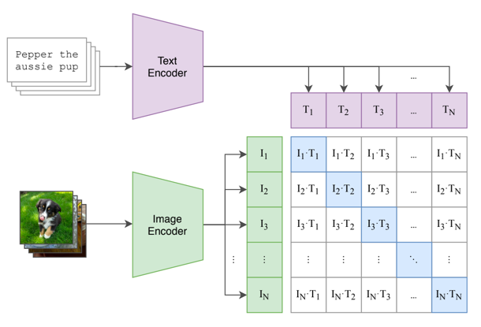

# CLIP-Chinese：中文多模态对比学习CLIP预训练模型

## 项目描述
微信公众号【YeungNLP】文章：[xxx]() ，文章内可获取140w中文图文对预训练数据，以及中文CLIP预训练权重。

CLIP是由OpenAI提出的一种多模态对比学习方法，原模型使用了4亿个图文对进行对比学习训练，在下游的各种任务上均取得了不错的效果，并且在Zero-Shot任务上效果也令人惊艳。 
模型论文可参考[CLIP论文：Learning Transferable Visual Models From Natural Language Supervision](https://arxiv.org/abs/2103.00020)

由于原生的CLIP模型是基于英文语料训练的，无法在中文任务中使用，本项目便是为了解决该问题。 本项目的主要工作如下：
- 编写Vit+Bert结构的CLIP模型，下面将其称为BertCLIP模型，以及预训练的pipeline。
- 基于LiT-tuning（Locked-image Text tuning）的方法，使用140万中文文本数据，对BertCLIP模型进行预训练。
- 在图文相似度、文本相似度、图图相似度等任务上，验证预训练模型的有效性。
- 分享140w中文图文对数据，分享预训练模型权重。


## 运行环境
python==3.8、transformers==4.18.0、torch==1.12.0


## 项目结构
- data:存放训练数据
  - images：存放训练图片
- images：存放一些测试的图片
- module:一些模块
  - argument.py：定制一些训练配置参数
  - configuration.py：模型配置config
  - datacollator.py
  - dataset.py
  - model.py：模型结构
- train_args：训练参数的配置文件
- download_image.py：下载图片的脚本
- filter_data.py：过滤训练数据的脚本
- train_clip.py：模型训练脚本
- predict_similarity.py：计算图文相似度、文本相似度、图图相似度的脚本

## 模型介绍与训练细节
笔者编写了一个基于Vit+Bert结构的BertCLIP模型，模型结构与原生CLIP大同小异，如下图所示。



预训练时，Vit与Bert分别加载不同的预训练权重，进行初始化。其中Vit的权重使用openai的clip模型进行初始化，
而Bert的权重使用mengzi中文预训练权重进行初始化。 

在训练的时候，使用LiT-tuning（Locked-image Text tuning）的策略，也就是将Vit的权重进行冻结，对模型的其他参数进行训练。使用140w的中文图文对，过滤掉一些坏图，
batch size=768，训练50个epoch，大概73100个step，最终训练loss降到xxx左右。

## 使用方法

### Quick Start
使用如下脚本，就可成功加载笔者分享的预训练权重，对图片和文本进行预处理，并且得到模型的输出

```python
from transformers import CLIPProcessor
from component.model import BertCLIPModel
from PIL import Image
import requests

model_name_or_path = ''
# 加载预训练模型权重
model = BertCLIPModel.from_pretrained(model_name_or_path)
CLIPProcessor.tokenizer_class = 'BertTokenizerFast'
# 初始化processor
processor = CLIPProcessor.from_pretrained(model_name_or_path)
# 预处理输入
url = "http://images.cocodataset.org/val2017/000000039769.jpg"
image = Image.open(requests.get(url, stream=True).raw)
inputs = processor(text=["一只小狗在摇尾巴", "一只小猪在吃饭"], images=image, return_tensors="pt", padding=True)
inputs.pop('token_type_ids')    # 输入中不包含token_type_ids

outputs = model(**inputs)

# 对于每张图片，计算其与所有文本的相似度
logits_per_image = outputs.logits_per_image  # image-text的相似度得分
probs = logits_per_image.softmax(dim=1)  # 对分数进行归一化

# 对于每个文本，计算其与所有图片的相似度
logits_per_text = outputs.logits_per_text  # text-image的相似度得分
probs = logits_per_text.softmax(dim=1)  # 对分数进行归一化

# 获得文本编码
text_embeds = outputs.text_embeds
# 获得图像编码
image_embeds = outputs.image_embeds
```

单独加载图像编码器，进行下游任务
```python
from PIL import Image
import requests
from transformers import CLIPProcessor, CLIPVisionModel

model_name_or_path = ''
model = CLIPVisionModel.from_pretrained(model_name_or_path)
CLIPProcessor.tokenizer_class = 'BertTokenizerFast'
processor = CLIPProcessor.from_pretrained(model_name_or_path)

url = "http://images.cocodataset.org/val2017/000000039769.jpg"
image = Image.open(requests.get(url, stream=True).raw)

inputs = processor(images=image, return_tensors="pt")

outputs = model(**inputs)
last_hidden_state = outputs.last_hidden_state
pooled_output = outputs.pooler_output 
```

单独加载文本编码器，进行下游任务

```python
from component.model import BertCLIPTextModel
from transformers import BertTokenizerFast

model_name_or_path = ''
model = BertCLIPTextModel.from_pretrained(model_name_or_path)
tokenizer = BertTokenizerFast.from_pretrained(model_name_or_path)

inputs = tokenizer(["一只小狗在摇尾巴", "一只小猪在吃饭"], padding=True, return_tensors="pt")
inputs.pop('token_type_ids')  # 输入中不包含token_type_ids

outputs = model(**inputs)
last_hidden_state = outputs.last_hidden_state
pooled_output = outputs.pooler_output
```

作者把训练好的Bert模型权重也单独拎出来，可以直接使用BertModel直接加载，进行下游任务
```python
from transformers import BertTokenizer, BertModel

model_name_or_path = ''
tokenizer = BertTokenizer.from_pretrained(model_name_or_path)
model = BertModel.from_pretrained(model_name_or_path)
```


### 获取训练数据
可以直接使用作者分享的140w的中文训练数据，数据可从公众号文章中获取。也可以使用自己的训练数据。训练数据为csv文件，格式如下，其中filename表示图片下载后的文件名。
```
text,url,filename
欧美夏季ebay连衣裙 气质圆领通勤绑带收腰连衣裙 zc3730,"https://gimg2.baidu.com/image_search/src=http%3A%2F%2Fcbu01.alicdn.com%2Fimg%2Fibank%2F2020%2F527%2F038%2F17187830725_1528924397.220x220.jpg&refer=http%3A%2F%2Fcbu01.alicdn.com&app=2002&size=f9999,10000&q=a80&n=0&g=0n&fmt=jpeg?sec=1632524815&t=d66159b43fb0335c11898f9764847ea7",test-0.jpg
"曾是名不见经传的王平,为何能够取代魏延,成为蜀汉",https://pic.rmb.bdstatic.com/19539b3b1a7e1daee93b0f3d99b8e795.png,test-1.jpg
女童黄色连衣裙,"https://gimg2.baidu.com/image_search/src=http%3A%2F%2Fa.vpimg2.com%2Fupload%2Fmerchandise%2F227958%2FLYQ-S314186413-3.jpg&refer=http%3A%2F%2Fa.vpimg2.com&app=2002&size=f9999,10000&q=a80&n=0&g=0n&fmt=jpeg?sec=1632501843&t=b0a3b843f9ecebd71fe6f27643c17486",test-2.jpg
```

### 下载图片
执行download_image.py脚本，可以直接多线程下载图片，只需要指定线程数、训练文件，以及图片保存路径即可。

### 配置训练参数
在train_args/train_clip.json中按需配置训练参数，参数说明如下：
- output_dir:训练输出路径
- clip_pretrain_path：clip模型的预训练权重
- bert_pretrain_path：bert模型的预训练权重
- load_from_bert_clip：是否使用BertCLIP的模型权重对模型进行初始化。若为False，则需要同时指定clip_pretrain_path与bert_pretrain_path，模型的Vit与Bert的权重分别加载自不同的预训练权重。若为True，则整个BertCLIP模型直接使用clip_pretrain_path的预训练权重进行初始化。
- image_path：存放图片的目录
- train_file：训练集
- test_file：测试集，如果为None，则不进行预测
- num_train_epochs：训练轮次
- max_steps：训练的最大步数，会覆盖num_train_epochs的效果
- per_device_train_batch_size：训练的batch size
- per_device_eval_batch_size：推理的batch size
- learning_rate：学习率
- max_seq_length：文本的最大长度
- logging_steps：多少步打印一次训练日志
- save_steps：多少步保存一次checkpoint
- save_total_limit：最多保存多少个checkpoint
- lr_scheduler_type：学习率的变化策略
- warmup_steps：warmup的步数，会覆盖warmup_ratio的效果
- warmup_ratio：warmup的比例
- gradient_accumulation_steps：梯度累计的步数
- optim：优化器
- seed：随机种子
- fp16：是否使用混合精度进行训练，最好设为True，可以使用更大的batch size，并且加快训练速度
- no_cuda：是否不使用GPU
- dataloader_num_workers：使用多少个线程加载训练数据，根据自己的机器情况，尽量设大一些，否则训练瓶颈会卡在读图片上


### 开始训练
```
CUDA_VISIBLE_DEVICES=0 python train_clip.py --train_args_file train_args/train_clip.json

后台运行：
CUDA_VISIBLE_DEVICES=0 nohup python train_clip.py --train_args_file train_args/train_clip.json &
```

### 相似度计算
作者实现了图文相似度、文本相似度、图图相似度的计算脚本，在xxx文件中


## 效果展示
### 图文相似度计算

### 文本相似度计算

### 图图相似度计算

## 模型权重分享

| 预训练模型         | 预训练模型地址 |模型描述|
|---------------|------|--------|
| BertCLIP的整体权重 |xxx |xxx|
| 预训练好的Bert的权重  |xxx |xxx|


